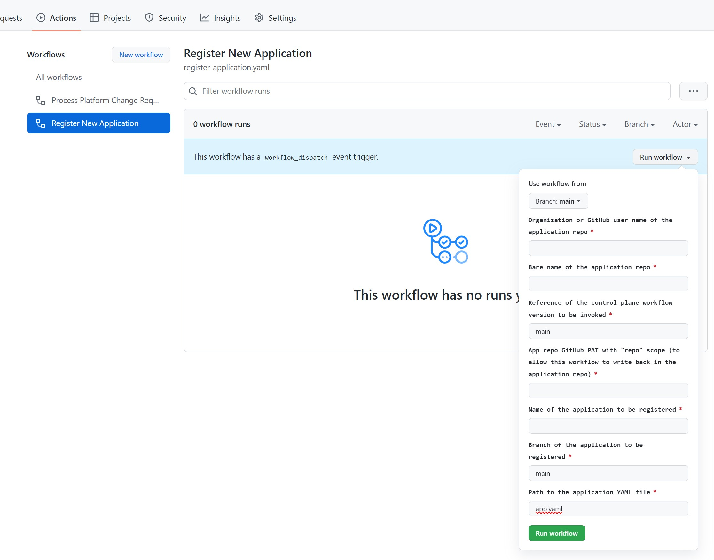

# Registering an application with the Coral platform

Once a development team has created an application, they follow specific steps for it to be deployed to Coral-managed clusters.

These steps include [creating an app.yaml](https://github.com/microsoft/coral-seed-java-api#application-deployment) file that describes the configuration of the application, as well as indicating the targets to which it should be deployed.

> **Note**
>
> The BigBang control plane seed creates a default workspace (called `coral-applications`) with a default target (called `void`). By default, all applications will be registered to this workspace. Additionally, the target is simply a template for the platform team to modify as needed. It is not intended to have clusters associated to it, and as deployed, the target could be used only to test the registration process.

## The BigBang application registration process

### Pre-requisites

As a pre-requirement, the workflow will be run using a specific Personal Access Token. This allows separation between the application registration and deployment activities from the rest of the activities in the Coral platform.

To register and subsequently trigger application deployment requests, create a PAT with `repo` scope and store it in this control plane repo with the name `CP_REPO_RENDER_TOKEN`.

### Registration

To register the application, the platform team will go to the control plane repo in GitHub and locate the `Register New Application workflow`. Using the `Run Workflow` option, they will enter the required parameters and trigger the workflow:

Although parameters are self-explanatory, here is some more information about them:

|Parameter|Comments|
|-|-|
|Use workflow from|This specifies which version of the workflow to run in this specific workflow run|
|Organization or Github user name of the application repo|If the application repo is at https://github.com/a-name/a-repo-name, this value would be `a-name`|
|Bare name of the application repo|If the application repo is at https://github.com/a-name/a-repo-name, this value would be `a-repo-name`|
|Reference of the control plane workflow version to be invoked|This specifies which version of the workflow be configured to run in the application repo|
|App repo GitHub PAT with "repo" scope (to allow this workflow to write back in the application repo)|This token with access to the application repo is required because this workflow needs to write to that repo to configure it. It is used for one run only and it is not stored. It can have a very short expiration time.|
|Name of the application to be registered|Name of the application as it will appear in the Coral platform. Simple identifier without special characters.|
|Branch of the application to be registered|This is the branch of the application that will contain the yaml file to be deployed.|
|Path to the application YAML file|The name of the yaml file where the application metadata for Coral is stored. Most documentation calls it app.yaml so only change it when absolutely needed.|

Registering an application using the application registration workflow accomplishes three things:

1. Updates this control plane repo with metadata of the application that is being registered

    This first step will create a reference in the default `coral-applications` workspace. Note that if other workspaces are required, the workflow needs to be adjusted properly, since it only considers the default workspace.
  
1. Updates the application's repo to configure the required information about this control repo for when an deployment request is needed.

   This next step stores three secrets in the application repo. This is possible because the workflow with use the token with permissions to write to the application repo (passed as parameters for `App repo GitHub PAT with "repo" scope (to allow this workflow to write back in the application repo)`)

   These secrets are required when triggering the workflow in that repo to request a deployment. The configured secrets are:

   * `CP_REPO`: This is the URL to the control plane repo
   * `CP_REF`: This is the branch that contains the version of the workflow to run (passed as parameter for `Reference of the control plane workflow version to be invoked`)
   * `CP_REPO_TOKEN`: This is the token with permissions to trigger the transformation (deployment) workflow in the control plane repo (configured as the pre-requisite `CP_REPO_RENDER_TOKEN` secret in the control plane repo)

1. Triggers an initial deployment request for the application

   Using the token stored in the `CP_REPO_RENDER_TOKEN` secret, it triggers the `Process Platform Change Requests` (transform.yaml) workflow, so that Coral processes the new registration.

## See Also

* [Introduction](../README.md)
* [Triggering a deployment](application-refresh.md)
