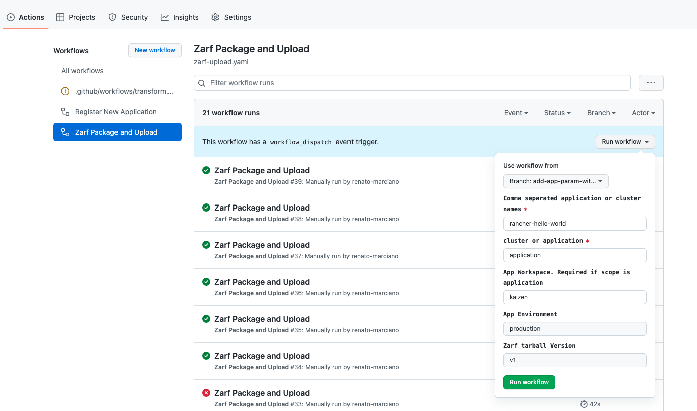

## Overview

[Zarf upload workflow](../.github/workflows/zarf-upload.yaml) is a workflow that will create the zarf tarball and upload it to an existing Azure Blob Storage to be consumed by another process for deployment into a cluster. 

This flow should be executed after the [transform workflow](../.github/workflows/transform.yaml) creates the zarf package descriptors in the GitOps Repository.

### Pre-requisites

[Create](https://docs.microsoft.com/en-us/azure/storage/common/storage-account-create?tabs=azure-portal) or have an existing Azure Storage Account. 

As a pre-requisite, add the following [Github secrets](https://docs.github.com/en/actions/security-guides/encrypted-secrets#creating-encrypted-secrets-for-a-repository):

1. `GITOPS_PAT`: [Generate a PAT Token](https://docs.github.com/en/authentication/keeping-your-account-and-data-secure/creating-a-personal-access-token) that has 'repo' scope for the GitOps Repository. Note that this may already exist as part of setup in the Transform Workflow. 
1. `CONTAINER_REGISTRY_USERNAME`: Container registry username used to pull container images for Zarf. For Iron Bank, please follow [zarf iron bank instructions](https://github.com/defenseunicorns/zarf/blob/master/docs/ironbank.md) for creating an account and retrieving CLI secrets.  
1. `CONTAINER_REGISTRY_SECRET`: Container registry secret used to pull container images for Zarf. For Iron Bank, please follow [zarf iron bank instructions](https://github.com/defenseunicorns/zarf/blob/master/docs/ironbank.md) for creating an account and retrieving CLI secrets.  
1. `AZURE_CREDENTIALS`: Azure credentials used for uploading the zarf tarball to an existing Azure Storage Account. Follow the instructions [configuring a service principal with a secret](https://github.com/marketplace/actions/azure-login#configure-a-service-principal-with-a-secret).

As a pre-requesite, update the following values in [zarf-upload.yaml](../.github/workflows/zarf-upload.yaml):

1. `GIT_OPS_REPO`: Name of the GitOps Repisotory.
1. `GIT_OPS_OWNER`: Github Owner/Organization of the GitOps Repository.
1. `STORAGE_ACCOUNT_RESOURCE_GROUP`: Azure Resource Group that contains the Azure Storage Account.
1. `STORAGE_ACCOUNT_NAME`: Name of an existing Azure Storage Account where you will be uploading the Zarf tarball.
1. `CONTAINER_REGISTRY`: Name of the private container registry containing images needed for Zarf. (i.e. Iron bank container registry is **registry1.dso.mil**).

### Trigger Zarf Upload Workflow

To package and upload zarf, the platform team will go to the control plane repo in GitHub and locate the `Zarf Package and Upload` workflow. Using the Run Workflow option, they will enter the required parameters and trigger the workflow:

|Parameter|Comments|
|-|-|
|Use workflow from|This specifies which version of the workflow to run in this specific workflow run|
| names| This is a comma separated value of cluster or app names. These cluster and application names are defined in both Control Plane Repo and GitOps Repo. See [cluster directory](../clusters/) for clusters and [applications directory](../applications/) for applications. You can set the value to `all` and it will package zarf for all clusters or apps (in a specified workspace and environment) defined. This is required.|
| scope | Either `cluster` or `application`. This will execute zarf package create either on a cluster or application level. This is required. |
| app_workspace | This is the workspace that contains the application for zarf packaging. See [workspace directory](../workspaces/). This is required when scope is application. |
| app_env | Choose a target environment defined for the application. This is optional with default value set to `production`|
| version | This is the version that is used for the Blob name suffix uploaded to Storage Account. This is optional. |

The workflow will `az login` using the azure credentials stored in secret and execute the [zarf-upload](../utils/zarf-upload.sh) script.
